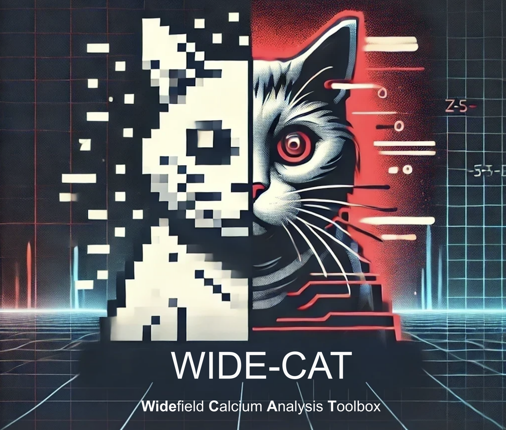
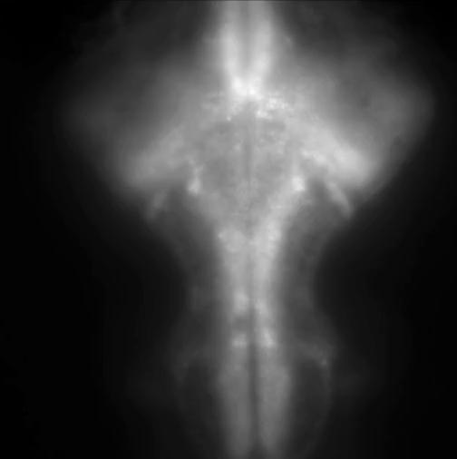
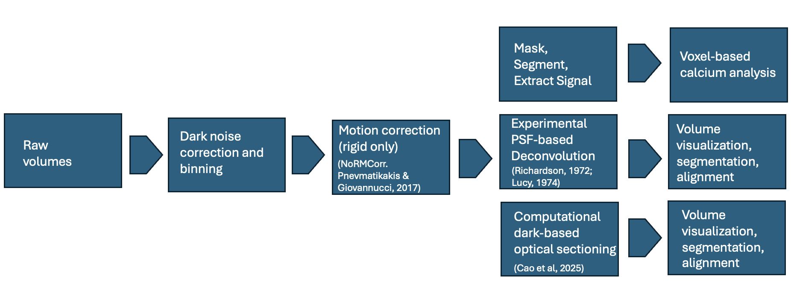
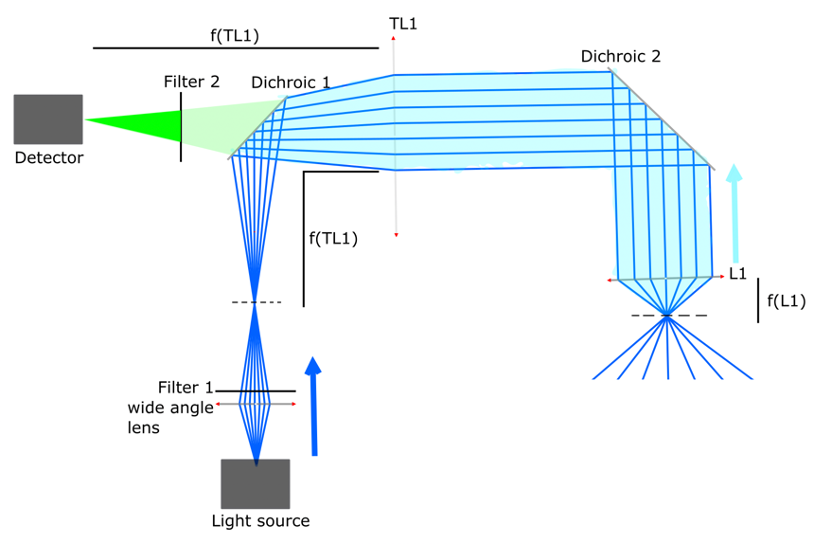
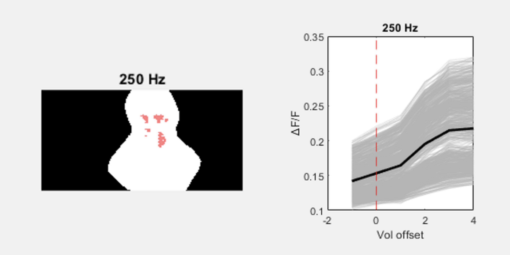
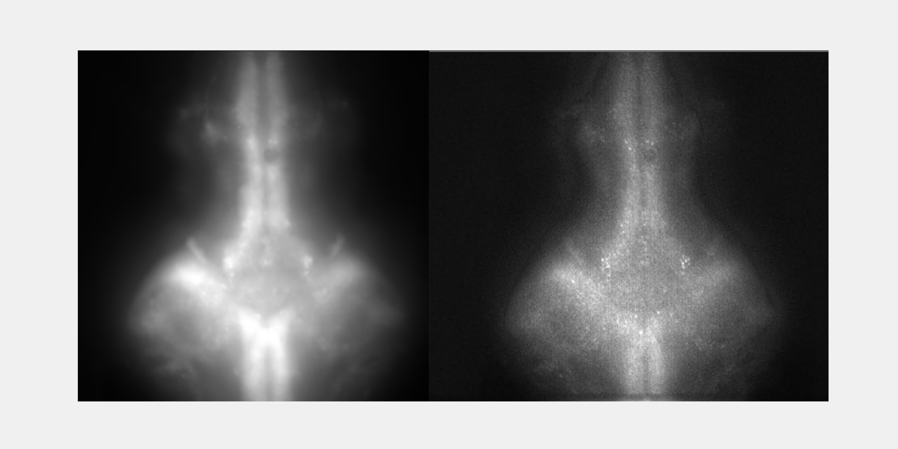

[](https://doi.org/10.5281/zenodo.22283475)

# Widefield Calcium Analysis Toolbox (WIDE-CAT)

<div align="center">
  
</div>

---

## Overview

This repository contains code for conducting **volumetric widefield calcium imaging** synchronized with **sensory stimulation**, including **auditory** and **visual** modalities. The system uses a piezo-driven objective (via NI DAQ), TTL-triggered camera, and Pygame-based stimulus delivery to ensure precise alignment with image acquisition. An example time-lapse acquisition from a mid-layer (~100um deep in the brain tissue) of a volumetric whole brain stack from a larval fish is shown below:

<div align="center">
  
</div>

Once raw volumetric imaging data is acquired, it undergoes a series of preprocessing steps including dark noise correction, spatial binning, and motion correction. Depending on the downstream goals, the processed data is then used either for voxel-based calcium signal analysis (functional pipeline) or for structural enhancement via PSF-based deconvolution or dark-based optical sectioning (morphological pipeline).

<div align="center">
  
</div>

---

## Features

**WIDE-CAT is a low-cost, open-source, and highly flexible widefield imaging system designed for large-scale calcium analysis, capable of capturing activity across the entire larval brain.**

1. **Acquisition**
   (accessible under the 'acquisition_scripts' folder)

- Synchronized z-stack acquisition using a piezo-driven objective.
- Camera triggering via NI DAQ (PFI output).
- Acquisition parameters such as acquisition rate, stim presentation duration and inter-sttimulus interval can be directly modified in the script under `acquisition_scripts`.

2. **Stimulus presentation**

- Non-blocking stimulus presentation.
- _Any_ visual or auditory stimulus can be presented. Current example is simply two visual stimuli (loaed as images) that alternate in their presentation.

3. **Preprocessing**
   (accessible under 'preprocess' folder; benefits from parallel processing)

- Check `preprocess` for all preprocessing related steps- binning, dark image subtraction, motion correction, deconvolution. Main scripts are prefixed Z01 and Z02.
- The default deconvolution comes with classical Richardson Lucy deconvolution with flexible padding. This script benefits from parallel processing.
- A quality check pipeline is created to quickly benchmark newer denosing and deconvolution methods against the existing method. Check `deconv_tests` and `compare_deconvolv_and_noisy` for this.

4. **Calcium activity analysis**
   ((accessible under 'ca_analysis_scripts' folder); benefits from parallel processing)

- The main scripts are prefixed as Z01 and Z02. The folder also contains various other functions that the main scripts rely on.
- Hexagonal ROI handling with flexible voxel sizing.
- Cluster-based permutation analysis (an fMRI-like approach).

---

## Requirements

- **For acquisition**:
  `cd` to `acquisition_scripts` and install Python dependencies:

```bash
pip install requirements.txt
```

- **For preprocessing and calcium analysis**:
  add the utility folder to your MATLAB path.

- **For dark-based optical sectioning**:
  clone and use this repository (see references below): https://github.com/Cao-ruijie/Dark-sectioning

Note:
If your dataset can benefit from DeepCAD-RT or N2V denoising, check out the methods directly at the below links, train a model on your dataset and integrate it in your version of the pipeline before the deconvolution step:
DeepCAD-RT: https://github.com/cabooster/DeepCAD-RT
N2V: https://github.com/juglab/n2v
If such a DL-based denoising is not necessary for your dataset, you can proceed directly with the Richardson–Lucy deconvolution step.

---

## Optical Path

The optical path of the widefield setup is shown below:

<div align="center">
  
</div>

`simulated using the ray optics simulator: Tu, Y.-T., et al. (2016). Ray Optics Simulation. Zenodo. (https://doi.org/10.5281/zenodo.6386611)`

---

## Hardware Components

- **Objective**: Thorlabs TL10X-2P (10X, NA 0.50)
- **Tube Lens**: Thorlabs TTL200-A (f = 200 mm)
- **Camera**: Hamamatsu ORCA-Flash4.0 (C13440-20CU, 6.5 µm pixels) (inexpensive alternatives with hardware triggering and similar pixel size should suffice; this model was used due to availability at the time)
- **Illumination**: EKB DLP-based light engine (cheaper light sources can be used; this DLP engine was chosen to enable DMD-based structured illumination for optional super-resolution imaging)
- **Z-Scanning**: Thorlabs PPC001 Piezo Controller
- **DAQ**: National Instruments
- **Visual Stimulus**: Optoma DLP projector
- **Auditory Stimulus**: amplifier and speaker

## Wiring Overview

| DAQ Channel | Connected To               | Function                        |
| ----------- | -------------------------- | ------------------------------- |
| `ao0`       | EXT IN (Piezo Controller)  | Drives piezo Z position         |
| `ao1`       | Oscilloscope (Optional)    | Mirrors piezo command signal    |
| `ai0`       | EXT OUT (Piezo Controller) | Reads piezo feedback (optional) |
| `PFI0`      | Camera trigger input       | Triggers camera per z-plane     |

---

## Application

Used for calcium imaging with synchronized sensory stimulation to study stimulus-response and circuit dynamics.

Here is an example of a small fraction of voxels identified to be locked in activity with a sound stimulus (L illustrates the position of the voxels on the brain mask and R shows the activity trace of these voxels wrt to the stimulation. Brain volumes acquired at ~0.5Hz):

<div align="center">
  
</div>

Below is an example of a computationally enhanced maximum intensity projection of a volumentric brain stack from the same larval fish as above (L is the raw stack and R is the enhanced stack):

<div align="center">
  
</div>

---

## Author

Developed by Gokul Rajan. Orger Lab, Champalimaud Foundation.

---

## Citation

Rajan, G. (2025). WIDE-CAT: Widefield Calcium Analysis Toolbox (v1.0.0). Zenodo. https://doi.org/10.5281/zenodo.17162471

---

## Acknowledgement

This was developed at the Champalimaud Foundation in the Vision to Action Laboratory of Michael B. Orger. Thanks to Adrien Jouary for useful discussions on the optical setup.

---

## References

Cao, R., Li, Y., Zhou, Y. et al. Dark-based optical sectioning assists background removal in fluorescence microscopy. Nat Methods (2025). https://doi.org/10.1038/s41592-025-02667-6

Eftychios A. Pnevmatikakis and Andrea Giovannucci, NoRMCorre: An online algorithm for piecewise rigid motion correction of calcium imaging data, Journal of Neuroscience Methods, vol. 291, pp 83-94, 2017; doi: https://doi.org/10.1016/j.jneumeth.2017.07.031

Krull, A., Buchholz, T.-O. & Jug, F. Noise2Void: Learning denoising from single noisy images. Proc. IEEE Conf. Comput. Vis. Pattern Recognit., 2129–2137 (2019).

Lucy, L. B. An iterative technique for the rectification of observed distributions. Astron. J. 79, 745 (1974). https://doi.org/10.1086/111605

Richardson, W. H. Bayesian-based iterative method of image restoration. J. Opt. Soc. Am. 62, 55–59 (1972). https://doi.org/10.1364/JOSA.62.000055

Tu, Y.-T., et al. (2016). Ray Optics Simulation. Zenodo. https://doi.org/10.5281/zenodo.6386611

Xinyang Li, Yixin Li, Yiliang Zhou, et al. Real-time denoising enables high-sensitivity fluorescence time-lapse imaging beyond the shot-noise limit. Nat. Biotechnol. (2022). https://doi.org/10.1038/s41587-022-01450-8

Xinyang Li, Guoxun Zhang, Jiamin Wu, et al. Reinforcing neuron extraction and spike inference in calcium imaging using deep self-supervised denoising. Nat. Methods 18, 1395–1400 (2021). https://doi.org/10.1038/s41592-021-01225-0

---

## License

WIDE-CAT is licensed under the GNU General Public License v3.0.  
See the [LICENSE](./LICENSE) file for details.
